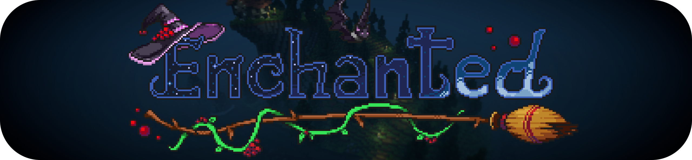

---
Enchanted is a witchcraft and occultism mod for Minecraft available on NeoForge and Fabric, based on real history, folklore and (of course) pop culture. There's a wide range of built-in content and a vast API to suit the needs of both players and other developers.

## Getting Started

### Installation

If you're a user, please refer to Enchanted's [CurseForge](https://www.curseforge.com/minecraft/mc-mods/enchanted-witchcraft) or [Modrinth](https://modrinth.com/mod/enchanted-witchcraft) pages.

For mod or modpack developers, you should visit [the wiki](https://github.com/Favouriteless/Enchanted/wiki) to see how to use the mod and API.

## Licensing

© 2022 Favouriteless, All Rights Reserved.

You may use the code on this repository as examples for educational purposes and to create additional content via the Enchanted API. For further use (for example, porting or forking) please contact Favouriteless via the [Discord](https://discord.gg/UkVgJ9nb5y) or GitHub.

### Contributions

You can view the Contributor Licensing Agreement for Enchanted [here](https://gist.github.com/Favouriteless/91756a9efa802571666cafab3513ffad).

TLDR: You retain ownership of the code, but grant an irrevocable license for it to be used in Enchanted.